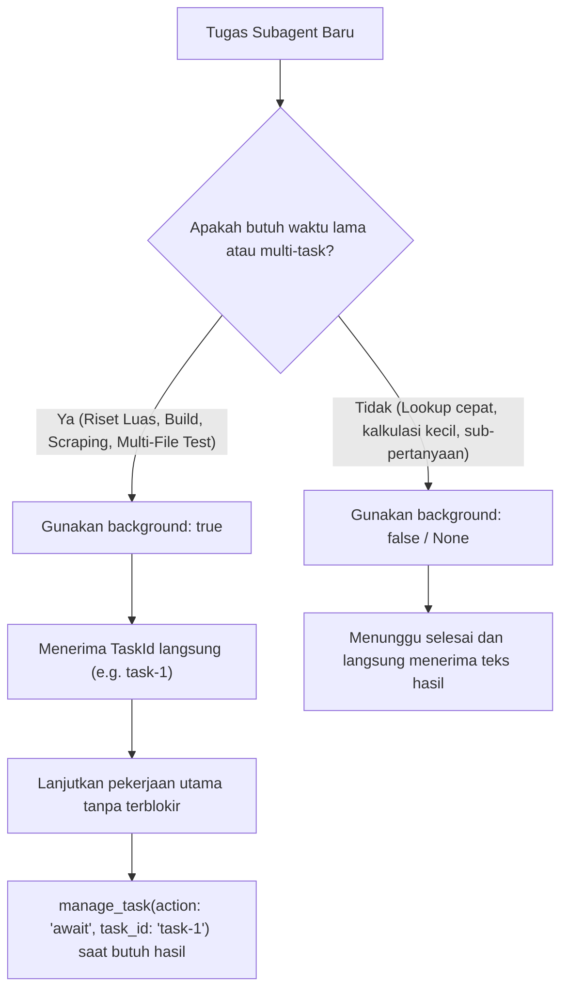

# 🤖 Buku Panduan AI Agent (AI Agent Handbook & Guidelines)

Selamat datang di panduan teknis operasional untuk **AI Coding Assistant** yang bekerja atau berkolaborasi di dalam proyek **ctrl-cli**.

Dokumen ini disusun untuk memberikan pemahaman arsitektural yang mendalam, aturan baku penulisan kode, pola delegasi subagent, serta pelajaran penting dari kegagalan masa lalu agar AI Agent dapat berkontribusi secara mandiri, aman, dan berstandar tinggi.

---

## 1. Mental Model & Invariant Arsitektur

Saat Anda membaca atau memodifikasi kode di repositori ini, pegang teguh prinsip-prinsip berikut:

1. **Pure Rust — Zero Tokio / Async Runtime**:
   - Jangan menambahkan dependensi `tokio`, `async-std`, `futures`, atau fungsi `async fn`.
   - Konkurensi dibangun di atas OS worker threads (`std::thread::spawn`) dan sinkronisasi blocking standar (`Arc`, `RwLock`, `Mutex`, `Condvar`, `AtomicBool`, `AtomicUsize`).
   - HTTP call dilakukan secara blocking menggunakan `ureq 2.10`.
2. **Ukuran Biner & Efisiensi Memori adalah Prioritas**:
   - Jaga agar ukuran biner release tetap di kisaran ~1.8 - 2.0 MB.
   - Hindari dependensi besar (heavy crates) yang menduplikasi fungsionalitas yang sudah ada di standard library.
3. **Multi-Platform Teruji (Khususnya Windows & Linux)**:
   - Proyek ini berjalan pada sistem operasi Windows (`USERPROFILE`, path separator `\`, timer resolution jitter).
   - Seluruh kode harus toleran terhadap perbedaan path dan latensi thread di Windows.

---

## 2. Pola Orkestrasi Subagent & Background Tasks

Sebagai agen, Anda memiliki kapabilitas untuk mendelegasikan tugas ke subagent melalui dua tool utama: `subagent` dan `manage_task`.

### Kapan Menggunakan Synchronous vs Background?



### Aturan Penggunaan Tool `manage_task`
- **Jangan Polling Berulang (Busy Waiting Loop)**: Hindari pemanggilan berulang `manage_task(action: "status")` tanpa jeda. Jika Anda perlu menunggu hasil task, gunakan `manage_task(action: "await", task_id: "...", timeout_secs: 30)`.
- **Pembersihan Log yang Rapi**: Jika ingin membaca riwayat jalannya task di background, gunakan `manage_task(action: "logs", task_id: "...", limit: 50)`.

---

## 3. Pelajaran Berharga & Jebakan Konkurensi ([`archive/DEAD_ENDS.md`](./archive/DEAD_ENDS.md))

Sebelum menyentuh logika konkurensi di `src/agent/tasks.rs` atau `src/agent/orchestrator.rs`, pelajari jebakan yang pernah dialami di [archive/DEAD_ENDS.md](./archive/DEAD_ENDS.md) berikut:

### ⚠️ 1. Jangan Gunakan `thread::sleep` Statis untuk Menunggu Perubahan State
- **Masalah**: Mengasumsikan thread worker akan berpindah dari `Queued` ke `Running` dalam 25ms sering gagal di Windows di bawah beban CPU tinggi.
- **Aturan**: Selalu gunakan mekanisme sinyal berbasis event (`Condvar`, channel, atau `AtomicBool` loop dengan batas aman) daripada sleep statis.

### ⚠️ 2. Jangan Menggunakan Threshold Waktu Wall-Clock Sempit di Pengujian
- **Masalah**: Pernyataan tes seperti `assert!(elapsed < 600ms)` atau `assert!(elapsed >= 25ms)` rentan menyebabkan *flaky test* di lingkungan CI atau Windows multitasking di mana latensi thread creation bisa berkisar antara 100ms hingga 2 detik.
- **Aturan**: Uji invariants logika (urutan transisi status, integritas data, ketiadaan deadlock, deduplikasi) daripada menguji durasi milidetik eksak.

### ⚠️ 3. Pencegahan Deadlock pada Mutex / RwLock
- **Masalah**: Menahan lock (`lock().unwrap()`) saat memanggil fungsi callback eksternal atau I/O blocking.
- **Aturan**: Selalu lepaskan lock (drop) sesegera mungkin sebelum melakukan I/O atau memanggil channel/thread join.

---

## 4. Cara Menambah Fitur Baru

### Menambah Tool Baru ke Agen
1. **Buat file modul**: Letakkan di `src/tools/<nama_tool>.rs`.
2. **Definisikan fungsi inti**:
   ```rust
   use anyhow::Result;
   use serde_json::Value;

   pub fn execute_my_tool(args: &Value) -> Result<String> {
       let param = args.get("param").and_then(|v| v.as_str())
           .ok_or_else(|| anyhow::anyhow!("'param' is required"))?;
       // Implementasi logika...
       Ok(format!("Hasil eksekusi: {}", param))
   }
   ```
3. **Daftarkan Schema Tool di `src/tools/mod.rs`**:
   Tambahkan skema JSON ke dalam fungsi `get_available_tools()`:
   ```rust
   ChatCompletionTool {
       tool_type: "function".to_string(),
       function: FunctionDefinition {
           name: "my_tool".to_string(),
           description: "Deskripsi kegunaan tool untuk LLM...".to_string(),
           parameters: json!({
               "type": "object",
               "properties": {
                   "param": { "type": "string", "description": "..." }
               },
               "required": ["param"]
           }),
       },
   }
   ```
4. **Tambahkan Handler Dispatch di `execute_tool()`**:
   ```rust
   "my_tool" => execute_my_tool(&call.function.arguments),
   ```
5. **Tentukan Kebijakan Keamanan di `src/agent/permissions.rs`**:
   Tentukan apakah tool termasuk operasi aman (`ReadOnly`) atau membutuhkan izin konfirmasi (`Mutating`).

### Menambah Skill Spesialis Baru
1. Buka `src/main.rs` pada fungsi `get_available_skills()`.
2. Tambahkan entri `Skill` baru dengan ID unik, nama display ber-emoji, deskripsi singkat, dan system prompt yang tajam:
   ```rust
   Skill {
       id: "devops-guru",
       name: "🐳 DevOps & Infrastructure",
       description: "Spesialis Docker, CI/CD, arsitektur cloud, & skrip deployment",
       system_prompt: "You are an elite DevOps engineer...",
   }
   ```

---

## 5. Standar Mutu Kode & Protokol Verifikasi

Setiap kali Anda selesai melakukan perubahan pada kode sumber, jalankan tiga perintah validasi berikut secara berurutan:

```bash
# 1. Pastikan nol peringatan dan nol error linter
cargo clippy --all-targets -- -D warnings

# 2. Pastikan format kode rapi dan konsisten
cargo fmt -- --check

# 3. Pastikan 100% tes unit dan integrasi lulus
cargo test
```

Jika salah satu perintah di atas menghasilkan peringatan atau kegagalan tes, Anda **wajib** memperbaikinya sebelum melaporkan tugas selesai kepada pengguna.
