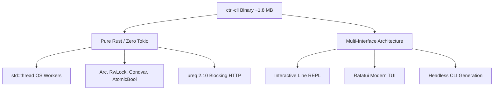
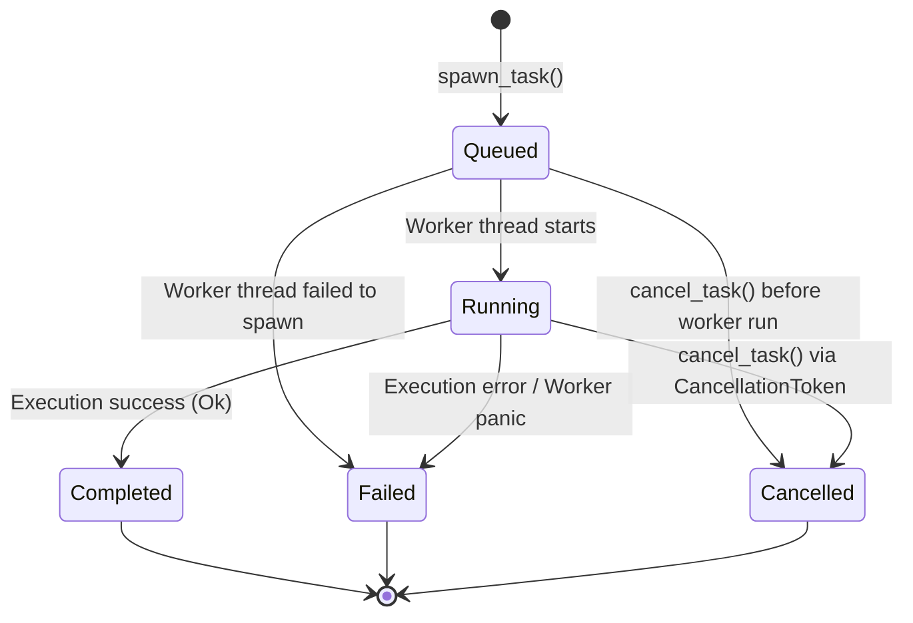
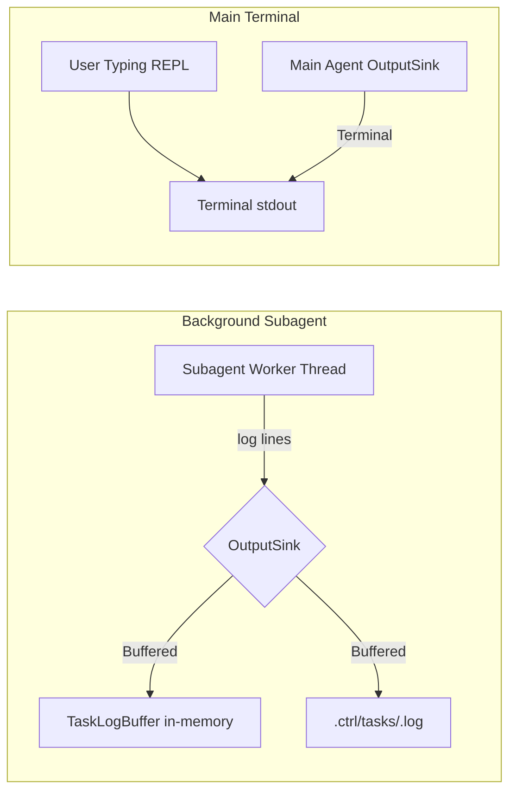
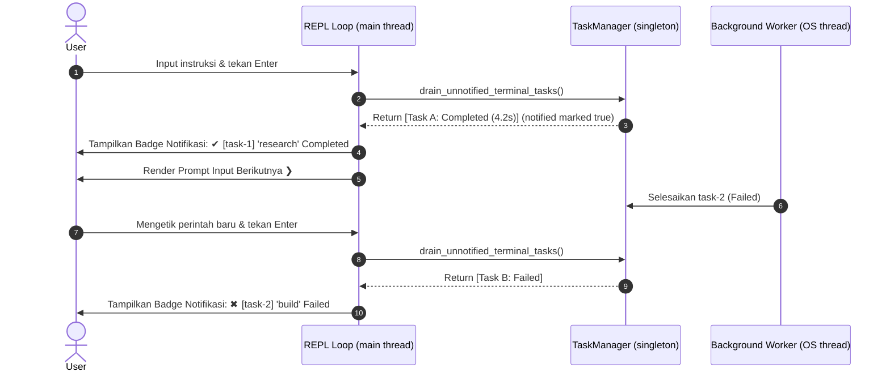

# 🏗️ Arsitektur Sistem (System Architecture)

Dokumen ini menjelaskan rancangan arsitektur teknis internal dari **ctrl-cli**, prinsip konkurensi pure Rust, siklus hidup task, isolasi log, dan alur orkestrasi subagent.

---

## 1. Filosofi Desain & Pilihan Teknologi



- **Zero-Async Runtime**: `ctrl-cli` tidak menggunakan Tokio atau async runtime lainnya. Seluruh operasi berbasis thread OS (`std::thread`) dan primitive sinkronisasi standar (`Arc`, `RwLock`, `Mutex`, `Condvar`, `AtomicBool`, `AtomicUsize`).
- **Efisiensi Biner & Kecepatan**: Menghasilkan biner akhir berukuran **~1.8 MB** (dengan LTO dan strip release), penggunaan memori RAM sangat rendah (<15 MB pada mode idle), dan startup instan (<10 ms).
- **HTTP Blocking**: Komunikasi API LLM (OpenAI dan Anthropic) menggunakan client `ureq 2.10` dengan dukungan TLS bawaan dan parsing JSON streaming SSE baris-demi-baris.

---

## 2. Struktur Modul & Komponen Inti

```
ctrl-cli/src/
├── agent/
│   ├── orchestrator.rs      # ReAct loop utama, streaming parser, tool dispatcher
│   ├── tasks.rs             # TaskManager, TaskRecord, TaskStatus, TaskLogBuffer
│   ├── subagent.rs          # Subagent runner (synchronous & background dispatch)
│   ├── provider.rs          # Registry provider multi-endpoint & ApiProtocol
│   ├── probe.rs             # Context window limit discovery & network probe
│   ├── permissions.rs       # PermissionGate (Ask, AutoApprove, ReadOnly)
│   ├── memory.rs            # Manajemen memori sesi & penyimpanan jangka panjang
│   ├── compaction.rs        # Algoritma kompaksi token & peringkasan riwayat
│   └── checkpoint.rs        # Snapshot file otomatis, /diff, & /undo rollback
├── tools/
│   ├── mod.rs               # Tool trait, katalog tools, manage_task handler
│   ├── filesystem.rs        # File I/O: read, write, edit (string replacement)
│   ├── search.rs            # File globbing & ripgrep text searching
│   ├── shell.rs             # Eksekusi command line aman dengan timeout
│   ├── web.rs               # DuckDuckGo search & web scraping to Markdown
│   ├── mcp.rs               # Model Context Protocol stdio client
│   ├── self_heal.rs         # Compiler diagnostic checks (cargo, tsc, python)
│   └── result_store.rs      # Penyimpanan payload besar di luar context window
├── tui/                     # Antarmuka TUI berbasis Ratatui & Crossterm
├── main.rs                  # CLI entrypoint, REPL loop, command specs, completer
└── types.rs                 # Struktur ChatMessage, ToolCall, Usage, JSON-RPC
```

---

## 3. Mesin Siklus Hidup Task (`TaskManager`)

`TaskManager` adalah registry global thread-safe yang mengelola seluruh siklus hidup background subagent.

### State Machine Transisi Status



### Invariant State Machine
1. **Transisi Searah**: Task yang telah mencapai status terminal (`Completed`, `Failed`, `Cancelled`) tidak dapat bertransisi ke status lain.
2. **Jaminan Populasi Durasi**: Nilai durasi (`elapsed` dan `elapsed_human`) dihitung secara monotonik sejak `spawn_task` dipanggil. Bahkan jika task dibatalkan saat masih berada di status `Queued`, durasi tetap tercatat akurat.
3. **Pembersihan Bersyarat**: Pemanggilan `remove_task(id)` akan menolak penghapusan task yang masih berstatus `Queued` atau `Running` untuk mencegah *orphan workers*.

---

## 4. Output Isolation & Thread-Safe Logging (`TaskLogBuffer`)

Saat beberapa subagent berjalan bersamaan di background, pengalihan output log menjadi sangat krusial agar tidak merusak tampilan terminal utama saat pengguna mengetik.



### Mekanisme Output Isolation
- **`OutputSink::Buffered(Arc<TaskLogBuffer>)`**: Seluruh output diagnostik, reasoning tokens, eksekusi tool, dan error dari background subagent dialihkan secara eksklusif ke buffer memori cincin (`VecDeque<String>`) berkapasitas 5.000 baris serta diarsipkan ke file disk `.ctrl/tasks/<id>.log`.
- **Penekanan Spinner**: Panggilan progress spinner terminal dinonaktifkan sepenuhnya (`sink.is_silent() == true`).
- **Bypass Prompt Interaktif**: Background subagent secara otomatis menggunakan `PermissionMode::AutoApprove` dan auto-resolve jawaban pada pertanyaan interaktif, menghindari deadlock akibat menunggu input terminal yang terisolasi.

---

## 5. Sistem Notifikasi Antar-Giliran (Inter-Turn Notification Flow)

Agar pengguna segera mengetahui ketika background subagent telah selesai tanpa menginterupsi baris input yang sedang diketik, `ctrl-cli` menerapkan **Inter-Turn Notification Drain**.



### Sifat Utama Notification Drain
- **Atomisitas Transaksi**: Pengambilan daftar task dan penandaan flag `notified = true` dilakukan di dalam satu write lock transaksi, mencegah duplikasi notifikasi saat ada beberapa awaiter konkuren.
- **Urutan Deterministik**: Notifikasi diurutkan berdasarkan ID numerik task (`task-1`, `task-2`, `task-10`).
- **Sekali Tayang (Once-Only)**: Setiap penyelesaian task diumumkan tepat 1 kali pada awal giliran berikutnya.
